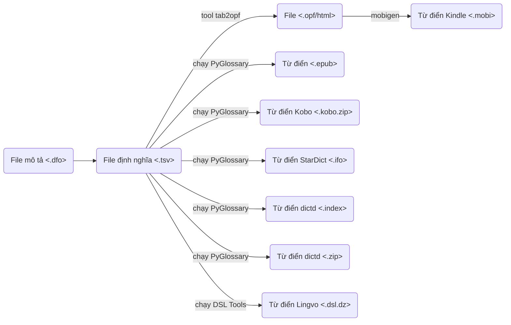

# Từ điển tiếng Việt dành cho máy đọc sách Kindle, Kobo, Pocketbook, Boox v.v. cũng như trên điện thoại và máy tính, như StarDict, Lingvo, Yomichan/Yomitan, v.v.

Mã nguồn cho từ điển dành cho máy đọc sách Kindle. Để sử dụng từ điển, download tại đây http://catusf.github.io/.

## Danh sách từ điển
| Số thứ tự | Name | Description | Ngôn ngữ gốc | Ngôn ngữ đích | Kindle | Yomitan/ Yomichan | StarDict | EPUB | DICT | Lingvo (DSL) | Kobo | Pleco |
|------------:|:-----------------------------------------------------|:-------------------------------------------------------------|:-----------------------|:-----------------------|:------------------------------------------------------------------------------------------------------------------------------|:-------------------------------------------------------------------------------------------------------------------------------------|:--------------------------------------------------------------------------------------------------------------------------------------|:------------------------------------------------------------------------------------------------------------------------------|:-----------------------------------------------------------------------------------------------------------------------------------|:--------------------------------------------------------------------------------------------------------------------------------|:----------------------------------------------------------------------------------------------------------------------------------|:-----------------------------------------------------------------------------------------------------------------------------------|
| 0 | | | | | [Download](https://github.com/catusf/tudien/releases/download/v3.0/all-kindle.zip) | [Download](https://github.com/catusf/tudien/releases/download/v3.0/all-yomitan.zip) | [Download](https://github.com/catusf/tudien/releases/download/v3.0/all-stardict.zip) | [Download](https://github.com/catusf/tudien/releases/download/v3.0/all-epub.zip) | [Download](https://github.com/catusf/tudien/releases/download/v3.0/all-dictd.zip) | [Download](https://github.com/catusf/tudien/releases/download/v3.0/all-lingvo.zip) | [Download](https://github.com/catusf/tudien/releases/download/v3.0/all-kobo.zip) | [Download](https://github.com/catusf/tudien/releases/download/v3.0/all-pleco.zip) |
| 1 | Bách khoa toàn thư v1.0 | Bách khoa toàn thư tiếng Việt | Tiếng Việt (vi) | Tiếng Việt (vi) | [Download](https://github.com/catusf/tudien/releases/download/v3.0/Bach_khoa_toan_thu.mobi) | [Download](https://github.com/catusf/tudien/releases/download/v3.0/Bach_khoa_toan_thu.yomitan.zip) | [Download](https://github.com/catusf/tudien/releases/download/v3.0/Bach_khoa_toan_thu.stardict.zip) | [Download](https://github.com/catusf/tudien/releases/download/v3.0/Bach_khoa_toan_thu.epub) | [Download](https://github.com/catusf/tudien/releases/download/v3.0/Bach_khoa_toan_thu.dictd.zip) | [Download](https://github.com/catusf/tudien/releases/download/v3.0/Bach_khoa_toan_thu.dsl.dz) | [Download](https://github.com/catusf/tudien/releases/download/v3.0/Bach_khoa_toan_thu.kobo.zip) | |
| 2 | English Irregular Verbs SPDict v1.1 | English Irregular Verbs SPDict | Tiếng Anh (en) | Tiếng Anh (en) | [Download](https://github.com/catusf/tudien/releases/download/v3.0/inflection-eng.tabSPDict-Irregular-Verbs.mobi) | [Download](https://github.com/catusf/tudien/releases/download/v3.0/inflection-eng.tabSPDict-Irregular-Verbs.yomitan.zip) | [Download](https://github.com/catusf/tudien/releases/download/v3.0/inflection-eng.tabSPDict-Irregular-Verbs.stardict.zip) | [Download](https://github.com/catusf/tudien/releases/download/v3.0/inflection-eng.tabSPDict-Irregular-Verbs.epub) | [Download](https://github.com/catusf/tudien/releases/download/v3.0/inflection-eng.tabSPDict-Irregular-Verbs.dictd.zip) | [Download](https://github.com/catusf/tudien/releases/download/v3.0/inflection-eng.tabSPDict-Irregular-Verbs.dsl.dz) | [Download](https://github.com/catusf/tudien/releases/download/v3.0/inflection-eng.tabSPDict-Irregular-Verbs.kobo.zip) | |
| 3 | Ngữ vựng danh từ thiền học v1.0 | Ngữ vựng danh từ thiền học | Tiếng Việt (vi) | Tiếng Việt (vi) | [Download](https://github.com/catusf/tudien/releases/download/v3.0/Ngu-vung-Danh-tu-Thien-hoc.mobi) | [Download](https://github.com/catusf/tudien/releases/download/v3.0/Ngu-vung-Danh-tu-Thien-hoc.yomitan.zip) | [Download](https://github.com/catusf/tudien/releases/download/v3.0/Ngu-vung-Danh-tu-Thien-hoc.stardict.zip) | [Download](https://github.com/catusf/tudien/releases/download/v3.0/Ngu-vung-Danh-tu-Thien-hoc.epub) | [Download](https://github.com/catusf/tudien/releases/download/v3.0/Ngu-vung-Danh-tu-Thien-hoc.dictd.zip) | [Download](https://github.com/catusf/tudien/releases/download/v3.0/Ngu-vung-Danh-tu-Thien-hoc.dsl.dz) | [Download](https://github.com/catusf/tudien/releases/download/v3.0/Ngu-vung-Danh-tu-Thien-hoc.kobo.zip) | |
| 4 | Phật quang Đại từ điển Hán ngữ v1.0 | Phật quang Đại từ điển Hán ngữ | Tiếng Trung (zh) | Tiếng Trung (zh) | [Download](https://github.com/catusf/tudien/releases/download/v3.0/Phat-Quang-Dai-tu-dien-Han-ngu.mobi) | [Download](https://github.com/catusf/tudien/releases/download/v3.0/Phat-Quang-Dai-tu-dien-Han-ngu.yomitan.zip) | [Download](https://github.com/catusf/tudien/releases/download/v3.0/Phat-Quang-Dai-tu-dien-Han-ngu.stardict.zip) | [Download](https://github.com/catusf/tudien/releases/download/v3.0/Phat-Quang-Dai-tu-dien-Han-ngu.epub) | [Download](https://github.com/catusf/tudien/releases/download/v3.0/Phat-Quang-Dai-tu-dien-Han-ngu.dictd.zip) | [Download](https://github.com/catusf/tudien/releases/download/v3.0/Phat-Quang-Dai-tu-dien-Han-ngu.dsl.dz) | [Download](https://github.com/catusf/tudien/releases/download/v3.0/Phat-Quang-Dai-tu-dien-Han-ngu.kobo.zip) | [Download](https://github.com/catusf/tudien/releases/download/v3.0/Phat-Quang-Dai-tu-dien-Han-ngu.pleco.zip) |
| 5 | Rộng mở tâm hồn v1.0 | Rộng mở tâm hồn | Tiếng Việt (vi) | Tiếng Việt (vi) | [Download](https://github.com/catusf/tudien/releases/download/v3.0/Rong-mo-tam-hon.mobi) | [Download](https://github.com/catusf/tudien/releases/download/v3.0/Rong-mo-tam-hon.yomitan.zip) | [Download](https://github.com/catusf/tudien/releases/download/v3.0/Rong-mo-tam-hon.stardict.zip) | [Download](https://github.com/catusf/tudien/releases/download/v3.0/Rong-mo-tam-hon.epub) | [Download](https://github.com/catusf/tudien/releases/download/v3.0/Rong-mo-tam-hon.dictd.zip) | [Download](https://github.com/catusf/tudien/releases/download/v3.0/Rong-mo-tam-hon.dsl.dz) | [Download](https://github.com/catusf/tudien/releases/download/v3.0/Rong-mo-tam-hon.kobo.zip) | |
| 6 | Từ Trung-Việt Beta v1.0 | Từ Trung-Việt Beta | Tiếng Trung (zh) | Tiếng Anh (en) | [Download](https://github.com/catusf/tudien/releases/download/v3.0/tvb_pleco.mobi) | [Download](https://github.com/catusf/tudien/releases/download/v3.0/tvb_pleco.yomitan.zip) | [Download](https://github.com/catusf/tudien/releases/download/v3.0/tvb_pleco.stardict.zip) | [Download](https://github.com/catusf/tudien/releases/download/v3.0/tvb_pleco.epub) | [Download](https://github.com/catusf/tudien/releases/download/v3.0/tvb_pleco.dictd.zip) | [Download](https://github.com/catusf/tudien/releases/download/v3.0/tvb_pleco.dsl.dz) | [Download](https://github.com/catusf/tudien/releases/download/v3.0/tvb_pleco.kobo.zip) | [Download](https://github.com/catusf/tudien/releases/download/v3.0/tvb_pleco.pleco.zip) |
| 7 | Từ diển Anh-Việt SPDict v1.0 | Từ diển Anh-Việt SPDict với các dạng từ tiếng Anh | Tiếng Anh (en) | Tiếng Việt (vi) | [Download](https://github.com/catusf/tudien/releases/download/v3.0/inflection-eng.tabSPDict-Anh-Viet.mobi) | [Download](https://github.com/catusf/tudien/releases/download/v3.0/inflection-eng.tabSPDict-Anh-Viet.yomitan.zip) | [Download](https://github.com/catusf/tudien/releases/download/v3.0/inflection-eng.tabSPDict-Anh-Viet.stardict.zip) | [Download](https://github.com/catusf/tudien/releases/download/v3.0/inflection-eng.tabSPDict-Anh-Viet.epub) | [Download](https://github.com/catusf/tudien/releases/download/v3.0/inflection-eng.tabSPDict-Anh-Viet.dictd.zip) | [Download](https://github.com/catusf/tudien/releases/download/v3.0/inflection-eng.tabSPDict-Anh-Viet.dsl.dz) | [Download](https://github.com/catusf/tudien/releases/download/v3.0/inflection-eng.tabSPDict-Anh-Viet.kobo.zip) | |
| 8 | Từ diển Anh-Việt-Anh SPDict v1.1 | Từ diển Anh-Việt-Anh SPDict với các dạng từ tiếng Anh | Tiếng Anh (en) | Tiếng Việt (vi) | [Download](https://github.com/catusf/tudien/releases/download/v3.0/inflection-eng.tabSPDict-Anh-Viet-Anh.mobi) | [Download](https://github.com/catusf/tudien/releases/download/v3.0/inflection-eng.tabSPDict-Anh-Viet-Anh.yomitan.zip) | [Download](https://github.com/catusf/tudien/releases/download/v3.0/inflection-eng.tabSPDict-Anh-Viet-Anh.stardict.zip) | [Download](https://github.com/catusf/tudien/releases/download/v3.0/inflection-eng.tabSPDict-Anh-Viet-Anh.epub) | [Download](https://github.com/catusf/tudien/releases/download/v3.0/inflection-eng.tabSPDict-Anh-Viet-Anh.dictd.zip) | [Download](https://github.com/catusf/tudien/releases/download/v3.0/inflection-eng.tabSPDict-Anh-Viet-Anh.dsl.dz) | [Download](https://github.com/catusf/tudien/releases/download/v3.0/inflection-eng.tabSPDict-Anh-Viet-Anh.kobo.zip) | |
| 9 | Từ diển Việt-Anh SPDict v1.0 | Từ diển Việt-Anh SPDict | Tiếng Việt (vi) | Tiếng Anh (en) | [Download](https://github.com/catusf/tudien/releases/download/v3.0/SPDict-Viet-Anh.mobi) | [Download](https://github.com/catusf/tudien/releases/download/v3.0/SPDict-Viet-Anh.yomitan.zip) | [Download](https://github.com/catusf/tudien/releases/download/v3.0/SPDict-Viet-Anh.stardict.zip) | [Download](https://github.com/catusf/tudien/releases/download/v3.0/SPDict-Viet-Anh.epub) | [Download](https://github.com/catusf/tudien/releases/download/v3.0/SPDict-Viet-Anh.dictd.zip) | [Download](https://github.com/catusf/tudien/releases/download/v3.0/SPDict-Viet-Anh.dsl.dz) | [Download](https://github.com/catusf/tudien/releases/download/v3.0/SPDict-Viet-Anh.kobo.zip) | |
| 10 | Từ điển Anh - Việt v1.1 | Từ điển Anh - Việt với các dạng từ | Tiếng Anh (en) | Tiếng Việt (vi) | [Download](https://github.com/catusf/tudien/releases/download/v3.0/inflection-eng.tabstar_anhviet.mobi) | [Download](https://github.com/catusf/tudien/releases/download/v3.0/inflection-eng.tabstar_anhviet.yomitan.zip) | [Download](https://github.com/catusf/tudien/releases/download/v3.0/inflection-eng.tabstar_anhviet.stardict.zip) | [Download](https://github.com/catusf/tudien/releases/download/v3.0/inflection-eng.tabstar_anhviet.epub) | [Download](https://github.com/catusf/tudien/releases/download/v3.0/inflection-eng.tabstar_anhviet.dictd.zip) | [Download](https://github.com/catusf/tudien/releases/download/v3.0/inflection-eng.tabstar_anhviet.dsl.dz) | [Download](https://github.com/catusf/tudien/releases/download/v3.0/inflection-eng.tabstar_anhviet.kobo.zip) | |
| 11 | Từ điển Anh-Việt Kinh doanh Prodict v1.1 | Từ điển Anh-Việt Kinh doanh Prodict | Tiếng Anh (en) | Tiếng Việt (vi) | [Download](https://github.com/catusf/tudien/releases/download/v3.0/inflection-eng.tabProdict_EV_business.mobi) | [Download](https://github.com/catusf/tudien/releases/download/v3.0/inflection-eng.tabProdict_EV_business.yomitan.zip) | [Download](https://github.com/catusf/tudien/releases/download/v3.0/inflection-eng.tabProdict_EV_business.stardict.zip) | [Download](https://github.com/catusf/tudien/releases/download/v3.0/inflection-eng.tabProdict_EV_business.epub) | [Download](https://github.com/catusf/tudien/releases/download/v3.0/inflection-eng.tabProdict_EV_business.dictd.zip) | [Download](https://github.com/catusf/tudien/releases/download/v3.0/inflection-eng.tabProdict_EV_business.dsl.dz) | [Download](https://github.com/catusf/tudien/releases/download/v3.0/inflection-eng.tabProdict_EV_business.kobo.zip) | |
| 12 | Từ điển Anh-Việt Kỹ thuật & Kinh doanh Prodict v1.1 | Từ điểnt Anh-Việt Kỹ thuật & Kinh doanh Prodict | Tiếng Anh (en) | Tiếng Anh (en) | [Download](https://github.com/catusf/tudien/releases/download/v3.0/inflection-eng.tabProdict_4in1_all.mobi) | [Download](https://github.com/catusf/tudien/releases/download/v3.0/inflection-eng.tabProdict_4in1_all.yomitan.zip) | [Download](https://github.com/catusf/tudien/releases/download/v3.0/inflection-eng.tabProdict_4in1_all.stardict.zip) | [Download](https://github.com/catusf/tudien/releases/download/v3.0/inflection-eng.tabProdict_4in1_all.epub) | [Download](https://github.com/catusf/tudien/releases/download/v3.0/inflection-eng.tabProdict_4in1_all.dictd.zip) | [Download](https://github.com/catusf/tudien/releases/download/v3.0/inflection-eng.tabProdict_4in1_all.dsl.dz) | [Download](https://github.com/catusf/tudien/releases/download/v3.0/inflection-eng.tabProdict_4in1_all.kobo.zip) | |
| 13 | Từ điển Anh-Việt Kỹ thuật Prodict v1.1 | Từ điển Anh-Việt Kỹ thuật Prodict | Tiếng Anh (en) | Tiếng Việt (vi) | [Download](https://github.com/catusf/tudien/releases/download/v3.0/inflection-eng.tabProdict_EV_Tech.mobi) | [Download](https://github.com/catusf/tudien/releases/download/v3.0/inflection-eng.tabProdict_EV_Tech.yomitan.zip) | [Download](https://github.com/catusf/tudien/releases/download/v3.0/inflection-eng.tabProdict_EV_Tech.stardict.zip) | [Download](https://github.com/catusf/tudien/releases/download/v3.0/inflection-eng.tabProdict_EV_Tech.epub) | [Download](https://github.com/catusf/tudien/releases/download/v3.0/inflection-eng.tabProdict_EV_Tech.dictd.zip) | [Download](https://github.com/catusf/tudien/releases/download/v3.0/inflection-eng.tabProdict_EV_Tech.dsl.dz) | [Download](https://github.com/catusf/tudien/releases/download/v3.0/inflection-eng.tabProdict_EV_Tech.kobo.zip) | |
| 14 | Từ điển Anh-Việt β v1.4 | Từ điển Anh-Việt β với các dạng từ tiếng Anh | Tiếng Anh (en) | Tiếng Việt (vi) | [Download](https://github.com/catusf/tudien/releases/download/v3.0/inflection-eng.tabTudienAnhVietBeta.mobi) | [Download](https://github.com/catusf/tudien/releases/download/v3.0/inflection-eng.tabTudienAnhVietBeta.yomitan.zip) | [Download](https://github.com/catusf/tudien/releases/download/v3.0/inflection-eng.tabTudienAnhVietBeta.stardict.zip) | [Download](https://github.com/catusf/tudien/releases/download/v3.0/inflection-eng.tabTudienAnhVietBeta.epub) | [Download](https://github.com/catusf/tudien/releases/download/v3.0/inflection-eng.tabTudienAnhVietBeta.dictd.zip) | [Download](https://github.com/catusf/tudien/releases/download/v3.0/inflection-eng.tabTudienAnhVietBeta.dsl.dz) | [Download](https://github.com/catusf/tudien/releases/download/v3.0/inflection-eng.tabTudienAnhVietBeta.kobo.zip) | |
| 15 | Từ điển Anh-Việt-Anh v1.1 | Từ điển Anh-Việt-Anh với các dạng từ tiếng Anh | Tiếng Anh (en) | Tiếng Việt (vi) | [Download](https://github.com/catusf/tudien/releases/download/v3.0/inflection-eng.tabTudienAnhVietAnh.mobi) | [Download](https://github.com/catusf/tudien/releases/download/v3.0/inflection-eng.tabTudienAnhVietAnh.yomitan.zip) | [Download](https://github.com/catusf/tudien/releases/download/v3.0/inflection-eng.tabTudienAnhVietAnh.stardict.zip) | [Download](https://github.com/catusf/tudien/releases/download/v3.0/inflection-eng.tabTudienAnhVietAnh.epub) | [Download](https://github.com/catusf/tudien/releases/download/v3.0/inflection-eng.tabTudienAnhVietAnh.dictd.zip) | [Download](https://github.com/catusf/tudien/releases/download/v3.0/inflection-eng.tabTudienAnhVietAnh.dsl.dz) | [Download](https://github.com/catusf/tudien/releases/download/v3.0/inflection-eng.tabTudienAnhVietAnh.kobo.zip) | |
| 16 | Từ điển Bồ Đào Nha - Việt v1.0 | Từ điển Bồ Đào Nha - Việt với các dạng từ | Tiếng Bồ Đào Nha (pt) | Tiếng Việt (vi) | [Download](https://github.com/catusf/tudien/releases/download/v3.0/inflection-por.tabstar_bdnviet.mobi) | [Download](https://github.com/catusf/tudien/releases/download/v3.0/inflection-por.tabstar_bdnviet.yomitan.zip) | [Download](https://github.com/catusf/tudien/releases/download/v3.0/inflection-por.tabstar_bdnviet.stardict.zip) | [Download](https://github.com/catusf/tudien/releases/download/v3.0/inflection-por.tabstar_bdnviet.epub) | [Download](https://github.com/catusf/tudien/releases/download/v3.0/inflection-por.tabstar_bdnviet.dictd.zip) | [Download](https://github.com/catusf/tudien/releases/download/v3.0/inflection-por.tabstar_bdnviet.dsl.dz) | [Download](https://github.com/catusf/tudien/releases/download/v3.0/inflection-por.tabstar_bdnviet.kobo.zip) | |
| 17 | Từ điển Hàn - Việt - Hàn v1.0 | Từ điển Hàn - Việt - Hàn | Tiếng Hàn (ko) | Tiếng Việt (vi) | [Download](https://github.com/catusf/tudien/releases/download/v3.0/star_hanviethan.mobi) | [Download](https://github.com/catusf/tudien/releases/download/v3.0/star_hanviethan.yomitan.zip) | [Download](https://github.com/catusf/tudien/releases/download/v3.0/star_hanviethan.stardict.zip) | [Download](https://github.com/catusf/tudien/releases/download/v3.0/star_hanviethan.epub) | [Download](https://github.com/catusf/tudien/releases/download/v3.0/star_hanviethan.dictd.zip) | [Download](https://github.com/catusf/tudien/releases/download/v3.0/star_hanviethan.dsl.dz) | [Download](https://github.com/catusf/tudien/releases/download/v3.0/star_hanviethan.kobo.zip) | |
| 18 | Từ điển Hàn - Việt v1.0 | Từ điển Hàn - Việt | Tiếng Hàn (ko) | Tiếng Việt (vi) | [Download](https://github.com/catusf/tudien/releases/download/v3.0/star_hanviet.mobi) | [Download](https://github.com/catusf/tudien/releases/download/v3.0/star_hanviet.yomitan.zip) | [Download](https://github.com/catusf/tudien/releases/download/v3.0/star_hanviet.stardict.zip) | [Download](https://github.com/catusf/tudien/releases/download/v3.0/star_hanviet.epub) | [Download](https://github.com/catusf/tudien/releases/download/v3.0/star_hanviet.dictd.zip) | [Download](https://github.com/catusf/tudien/releases/download/v3.0/star_hanviet.dsl.dz) | [Download](https://github.com/catusf/tudien/releases/download/v3.0/star_hanviet.kobo.zip) | |
| 19 | Từ điển Hán ngữ v1.0 | Từ điển Hán ngữ | Tiếng Việt (vi) | Tiếng Việt (vi) | [Download](https://github.com/catusf/tudien/releases/download/v3.0/Tu_dien_Han_ngu.mobi) | [Download](https://github.com/catusf/tudien/releases/download/v3.0/Tu_dien_Han_ngu.yomitan.zip) | [Download](https://github.com/catusf/tudien/releases/download/v3.0/Tu_dien_Han_ngu.stardict.zip) | [Download](https://github.com/catusf/tudien/releases/download/v3.0/Tu_dien_Han_ngu.epub) | [Download](https://github.com/catusf/tudien/releases/download/v3.0/Tu_dien_Han_ngu.dictd.zip) | [Download](https://github.com/catusf/tudien/releases/download/v3.0/Tu_dien_Han_ngu.dsl.dz) | [Download](https://github.com/catusf/tudien/releases/download/v3.0/Tu_dien_Han_ngu.kobo.zip) | |
| 20 | Từ điển Na Uy - Việt v1.0 | Từ điển Na Uy - Việt với các dạng từ | no | Tiếng Việt (vi) | [Download](https://github.com/catusf/tudien/releases/download/v3.0/inflection-nno.tabstar_nauyviet.mobi) | [Download](https://github.com/catusf/tudien/releases/download/v3.0/inflection-nno.tabstar_nauyviet.yomitan.zip) | [Download](https://github.com/catusf/tudien/releases/download/v3.0/inflection-nno.tabstar_nauyviet.stardict.zip) | [Download](https://github.com/catusf/tudien/releases/download/v3.0/inflection-nno.tabstar_nauyviet.epub) | [Download](https://github.com/catusf/tudien/releases/download/v3.0/inflection-nno.tabstar_nauyviet.dictd.zip) | [Download](https://github.com/catusf/tudien/releases/download/v3.0/inflection-nno.tabstar_nauyviet.dsl.dz) | [Download](https://github.com/catusf/tudien/releases/download/v3.0/inflection-nno.tabstar_nauyviet.kobo.zip) | |
| 21 | Từ điển Nga - Việt - Nga v1.0 | Từ điển Nga - Việt - Nga với các dạng từ | Tiếng Nga (ru) | Tiếng Việt (vi) | [Download](https://github.com/catusf/tudien/releases/download/v3.0/inflection-rus.tabstar_ngavietnga.mobi) | [Download](https://github.com/catusf/tudien/releases/download/v3.0/inflection-rus.tabstar_ngavietnga.yomitan.zip) | [Download](https://github.com/catusf/tudien/releases/download/v3.0/inflection-rus.tabstar_ngavietnga.stardict.zip) | [Download](https://github.com/catusf/tudien/releases/download/v3.0/inflection-rus.tabstar_ngavietnga.epub) | [Download](https://github.com/catusf/tudien/releases/download/v3.0/inflection-rus.tabstar_ngavietnga.dictd.zip) | [Download](https://github.com/catusf/tudien/releases/download/v3.0/inflection-rus.tabstar_ngavietnga.dsl.dz) | [Download](https://github.com/catusf/tudien/releases/download/v3.0/inflection-rus.tabstar_ngavietnga.kobo.zip) | |
| 22 | Từ điển Nga - Việt v1.0 | Từ điển Nga - Việt với các dạng từ | Tiếng Nga (ru) | Tiếng Việt (vi) | [Download](https://github.com/catusf/tudien/releases/download/v3.0/inflection-rus.tabstar_ngaviet.mobi) | [Download](https://github.com/catusf/tudien/releases/download/v3.0/inflection-rus.tabstar_ngaviet.yomitan.zip) | [Download](https://github.com/catusf/tudien/releases/download/v3.0/inflection-rus.tabstar_ngaviet.stardict.zip) | [Download](https://github.com/catusf/tudien/releases/download/v3.0/inflection-rus.tabstar_ngaviet.epub) | [Download](https://github.com/catusf/tudien/releases/download/v3.0/inflection-rus.tabstar_ngaviet.dictd.zip) | [Download](https://github.com/catusf/tudien/releases/download/v3.0/inflection-rus.tabstar_ngaviet.dsl.dz) | [Download](https://github.com/catusf/tudien/releases/download/v3.0/inflection-rus.tabstar_ngaviet.kobo.zip) | |
| 23 | Từ điển Nhật - Việt - Nhật v1.0 | Từ điển Nhật - Việt - Nhật | Tiếng Nhật (ja) | Tiếng Việt (vi) | [Download](https://github.com/catusf/tudien/releases/download/v3.0/star_nhatvietnhat.mobi) | [Download](https://github.com/catusf/tudien/releases/download/v3.0/star_nhatvietnhat.yomitan.zip) | [Download](https://github.com/catusf/tudien/releases/download/v3.0/star_nhatvietnhat.stardict.zip) | [Download](https://github.com/catusf/tudien/releases/download/v3.0/star_nhatvietnhat.epub) | [Download](https://github.com/catusf/tudien/releases/download/v3.0/star_nhatvietnhat.dictd.zip) | [Download](https://github.com/catusf/tudien/releases/download/v3.0/star_nhatvietnhat.dsl.dz) | [Download](https://github.com/catusf/tudien/releases/download/v3.0/star_nhatvietnhat.kobo.zip) | |
| 24 | Từ điển Nhật - Việt v1.0 | Từ điển Nhật - Việt | Tiếng Nhật (ja) | Tiếng Việt (vi) | [Download](https://github.com/catusf/tudien/releases/download/v3.0/star_nhatviet.mobi) | [Download](https://github.com/catusf/tudien/releases/download/v3.0/star_nhatviet.yomitan.zip) | [Download](https://github.com/catusf/tudien/releases/download/v3.0/star_nhatviet.stardict.zip) | [Download](https://github.com/catusf/tudien/releases/download/v3.0/star_nhatviet.epub) | [Download](https://github.com/catusf/tudien/releases/download/v3.0/star_nhatviet.dictd.zip) | [Download](https://github.com/catusf/tudien/releases/download/v3.0/star_nhatviet.dsl.dz) | [Download](https://github.com/catusf/tudien/releases/download/v3.0/star_nhatviet.kobo.zip) | |
| 25 | Từ điển Pháp - Việt - Pháp v1.0 | Từ điển Pháp - Việt - Pháp với các dạng từ | Tiếng Pháp (fr) | Tiếng Việt (vi) | [Download](https://github.com/catusf/tudien/releases/download/v3.0/inflection-fra.tabstar_phapvietphap.mobi) | [Download](https://github.com/catusf/tudien/releases/download/v3.0/inflection-fra.tabstar_phapvietphap.yomitan.zip) | [Download](https://github.com/catusf/tudien/releases/download/v3.0/inflection-fra.tabstar_phapvietphap.stardict.zip) | [Download](https://github.com/catusf/tudien/releases/download/v3.0/inflection-fra.tabstar_phapvietphap.epub) | [Download](https://github.com/catusf/tudien/releases/download/v3.0/inflection-fra.tabstar_phapvietphap.dictd.zip) | [Download](https://github.com/catusf/tudien/releases/download/v3.0/inflection-fra.tabstar_phapvietphap.dsl.dz) | [Download](https://github.com/catusf/tudien/releases/download/v3.0/inflection-fra.tabstar_phapvietphap.kobo.zip) | |
| 26 | Từ điển Pháp - Việt v1.0 | Từ điển Pháp - Việt với các dạng từ | Tiếng Pháp (fr) | Tiếng Việt (vi) | [Download](https://github.com/catusf/tudien/releases/download/v3.0/inflection-fra.tabstar_phapviet.mobi) | [Download](https://github.com/catusf/tudien/releases/download/v3.0/inflection-fra.tabstar_phapviet.yomitan.zip) | [Download](https://github.com/catusf/tudien/releases/download/v3.0/inflection-fra.tabstar_phapviet.stardict.zip) | [Download](https://github.com/catusf/tudien/releases/download/v3.0/inflection-fra.tabstar_phapviet.epub) | [Download](https://github.com/catusf/tudien/releases/download/v3.0/inflection-fra.tabstar_phapviet.dictd.zip) | [Download](https://github.com/catusf/tudien/releases/download/v3.0/inflection-fra.tabstar_phapviet.dsl.dz) | [Download](https://github.com/catusf/tudien/releases/download/v3.0/inflection-fra.tabstar_phapviet.kobo.zip) | |
| 27 | Từ điển Phật Quang v1.0 | Từ điển Phật Quang | Tiếng Việt (vi) | Tiếng Việt (vi) | [Download](https://github.com/catusf/tudien/releases/download/v3.0/Tu-dien-Phat-Quang.mobi) | [Download](https://github.com/catusf/tudien/releases/download/v3.0/Tu-dien-Phat-Quang.yomitan.zip) | [Download](https://github.com/catusf/tudien/releases/download/v3.0/Tu-dien-Phat-Quang.stardict.zip) | [Download](https://github.com/catusf/tudien/releases/download/v3.0/Tu-dien-Phat-Quang.epub) | [Download](https://github.com/catusf/tudien/releases/download/v3.0/Tu-dien-Phat-Quang.dictd.zip) | [Download](https://github.com/catusf/tudien/releases/download/v3.0/Tu-dien-Phat-Quang.dsl.dz) | [Download](https://github.com/catusf/tudien/releases/download/v3.0/Tu-dien-Phat-Quang.kobo.zip) | |
| 28 | Từ điển Phật học Anh-Hán-Việt v1.1 | Từ điển Phật học Anh-Hán-Việt | Tiếng Anh (en) | Tiếng Việt (vi) | [Download](https://github.com/catusf/tudien/releases/download/v3.0/inflection-eng.tabTu-dien-Phat-hoc-Anh-Han-Viet.mobi) | [Download](https://github.com/catusf/tudien/releases/download/v3.0/inflection-eng.tabTu-dien-Phat-hoc-Anh-Han-Viet.yomitan.zip) | [Download](https://github.com/catusf/tudien/releases/download/v3.0/inflection-eng.tabTu-dien-Phat-hoc-Anh-Han-Viet.stardict.zip) | [Download](https://github.com/catusf/tudien/releases/download/v3.0/inflection-eng.tabTu-dien-Phat-hoc-Anh-Han-Viet.epub) | [Download](https://github.com/catusf/tudien/releases/download/v3.0/inflection-eng.tabTu-dien-Phat-hoc-Anh-Han-Viet.dictd.zip) | [Download](https://github.com/catusf/tudien/releases/download/v3.0/inflection-eng.tabTu-dien-Phat-hoc-Anh-Han-Viet.dsl.dz) | [Download](https://github.com/catusf/tudien/releases/download/v3.0/inflection-eng.tabTu-dien-Phat-hoc-Anh-Han-Viet.kobo.zip) | |
| 29 | Từ điển Phật học Tinh tuyển v1.0 | Từ điển Phật học Tinh tuyển | Tiếng Việt (vi) | Tiếng Việt (vi) | [Download](https://github.com/catusf/tudien/releases/download/v3.0/Tu-dien-Phat-hoc-Tinh-tuyen.mobi) | [Download](https://github.com/catusf/tudien/releases/download/v3.0/Tu-dien-Phat-hoc-Tinh-tuyen.yomitan.zip) | [Download](https://github.com/catusf/tudien/releases/download/v3.0/Tu-dien-Phat-hoc-Tinh-tuyen.stardict.zip) | [Download](https://github.com/catusf/tudien/releases/download/v3.0/Tu-dien-Phat-hoc-Tinh-tuyen.epub) | [Download](https://github.com/catusf/tudien/releases/download/v3.0/Tu-dien-Phat-hoc-Tinh-tuyen.dictd.zip) | [Download](https://github.com/catusf/tudien/releases/download/v3.0/Tu-dien-Phat-hoc-Tinh-tuyen.dsl.dz) | [Download](https://github.com/catusf/tudien/releases/download/v3.0/Tu-dien-Phat-hoc-Tinh-tuyen.kobo.zip) | |
| 30 | Từ điển Phật học Việt Anh - Minh Thông v1.0 | Từ điển Phật học Việt Anh - Minh Thông | Tiếng Việt (vi) | Tiếng Anh (en) | [Download](https://github.com/catusf/tudien/releases/download/v3.0/Tu-dien-Phat-hoc-Viet-Anh-Minh-Thong.mobi) | [Download](https://github.com/catusf/tudien/releases/download/v3.0/Tu-dien-Phat-hoc-Viet-Anh-Minh-Thong.yomitan.zip) | [Download](https://github.com/catusf/tudien/releases/download/v3.0/Tu-dien-Phat-hoc-Viet-Anh-Minh-Thong.stardict.zip) | [Download](https://github.com/catusf/tudien/releases/download/v3.0/Tu-dien-Phat-hoc-Viet-Anh-Minh-Thong.epub) | [Download](https://github.com/catusf/tudien/releases/download/v3.0/Tu-dien-Phat-hoc-Viet-Anh-Minh-Thong.dictd.zip) | [Download](https://github.com/catusf/tudien/releases/download/v3.0/Tu-dien-Phat-hoc-Viet-Anh-Minh-Thong.dsl.dz) | [Download](https://github.com/catusf/tudien/releases/download/v3.0/Tu-dien-Phat-hoc-Viet-Anh-Minh-Thong.kobo.zip) | |
| 31 | Từ điển Phật học Việt Anh - Thiện Phúc v1.0 | Từ điển Phật học Việt Anh - Thiện Phúc | Tiếng Việt (vi) | Tiếng Anh (en) | [Download](https://github.com/catusf/tudien/releases/download/v3.0/Tu-dien-Phat-hoc-Viet-Anh-Thien-Phuc.mobi) | [Download](https://github.com/catusf/tudien/releases/download/v3.0/Tu-dien-Phat-hoc-Viet-Anh-Thien-Phuc.yomitan.zip) | [Download](https://github.com/catusf/tudien/releases/download/v3.0/Tu-dien-Phat-hoc-Viet-Anh-Thien-Phuc.stardict.zip) | [Download](https://github.com/catusf/tudien/releases/download/v3.0/Tu-dien-Phat-hoc-Viet-Anh-Thien-Phuc.epub) | [Download](https://github.com/catusf/tudien/releases/download/v3.0/Tu-dien-Phat-hoc-Viet-Anh-Thien-Phuc.dictd.zip) | [Download](https://github.com/catusf/tudien/releases/download/v3.0/Tu-dien-Phat-hoc-Viet-Anh-Thien-Phuc.dsl.dz) | [Download](https://github.com/catusf/tudien/releases/download/v3.0/Tu-dien-Phat-hoc-Viet-Anh-Thien-Phuc.kobo.zip) | |
| 32 | Từ điển Phật học Việt Anh - Đồng Loại v1.0 | Từ điển Phật học Việt Anh - Đồng Loại | Tiếng Việt (vi) | Tiếng Anh (en) | [Download](https://github.com/catusf/tudien/releases/download/v3.0/Tu-dien-Phat-hoc-Viet-Anh-Dong-Loai.mobi) | [Download](https://github.com/catusf/tudien/releases/download/v3.0/Tu-dien-Phat-hoc-Viet-Anh-Dong-Loai.yomitan.zip) | [Download](https://github.com/catusf/tudien/releases/download/v3.0/Tu-dien-Phat-hoc-Viet-Anh-Dong-Loai.stardict.zip) | [Download](https://github.com/catusf/tudien/releases/download/v3.0/Tu-dien-Phat-hoc-Viet-Anh-Dong-Loai.epub) | [Download](https://github.com/catusf/tudien/releases/download/v3.0/Tu-dien-Phat-hoc-Viet-Anh-Dong-Loai.dictd.zip) | [Download](https://github.com/catusf/tudien/releases/download/v3.0/Tu-dien-Phat-hoc-Viet-Anh-Dong-Loai.dsl.dz) | [Download](https://github.com/catusf/tudien/releases/download/v3.0/Tu-dien-Phat-hoc-Viet-Anh-Dong-Loai.kobo.zip) | |
| 33 | Từ điển Séc - Việt v1.0 | Từ điển Séc - Việt với các dạng từ | cs | Tiếng Việt (vi) | [Download](https://github.com/catusf/tudien/releases/download/v3.0/inflection-ces.tabstar_secviet.mobi) | [Download](https://github.com/catusf/tudien/releases/download/v3.0/inflection-ces.tabstar_secviet.yomitan.zip) | [Download](https://github.com/catusf/tudien/releases/download/v3.0/inflection-ces.tabstar_secviet.stardict.zip) | [Download](https://github.com/catusf/tudien/releases/download/v3.0/inflection-ces.tabstar_secviet.epub) | [Download](https://github.com/catusf/tudien/releases/download/v3.0/inflection-ces.tabstar_secviet.dictd.zip) | [Download](https://github.com/catusf/tudien/releases/download/v3.0/inflection-ces.tabstar_secviet.dsl.dz) | [Download](https://github.com/catusf/tudien/releases/download/v3.0/inflection-ces.tabstar_secviet.kobo.zip) | |
| 34 | Từ điển Tiếng Việt | Từ điển Tiếng Việt (Hồ Ngọc Đức) | Tiếng Ý (it) | Tiếng Việt (vi) | [Download](https://github.com/catusf/tudien/releases/download/v3.0/star_vietviet.mobi) | [Download](https://github.com/catusf/tudien/releases/download/v3.0/star_vietviet.yomitan.zip) | [Download](https://github.com/catusf/tudien/releases/download/v3.0/star_vietviet.stardict.zip) | [Download](https://github.com/catusf/tudien/releases/download/v3.0/star_vietviet.epub) | [Download](https://github.com/catusf/tudien/releases/download/v3.0/star_vietviet.dictd.zip) | [Download](https://github.com/catusf/tudien/releases/download/v3.0/star_vietviet.dsl.dz) | [Download](https://github.com/catusf/tudien/releases/download/v3.0/star_vietviet.kobo.zip) | |
| 35 | Từ điển Trung - Việt v1.0 | Từ điển Trung - Việt | Tiếng Trung (zh) | Tiếng Việt (vi) | [Download](https://github.com/catusf/tudien/releases/download/v3.0/star_trungviet.mobi) | [Download](https://github.com/catusf/tudien/releases/download/v3.0/star_trungviet.yomitan.zip) | [Download](https://github.com/catusf/tudien/releases/download/v3.0/star_trungviet.stardict.zip) | [Download](https://github.com/catusf/tudien/releases/download/v3.0/star_trungviet.epub) | [Download](https://github.com/catusf/tudien/releases/download/v3.0/star_trungviet.dictd.zip) | [Download](https://github.com/catusf/tudien/releases/download/v3.0/star_trungviet.dsl.dz) | [Download](https://github.com/catusf/tudien/releases/download/v3.0/star_trungviet.kobo.zip) | [Download](https://github.com/catusf/tudien/releases/download/v3.0/star_trungviet.pleco.zip) |
| 36 | Từ điển Tây Ban Nha - Việt - Tây Ban Nha v1.0 | Từ điển Tây Ban Nha - Việt - Tây Ban Nha với các dạng từ | Tiếng Tây Ban Nha (es) | Tiếng Việt (vi) | [Download](https://github.com/catusf/tudien/releases/download/v3.0/inflection-spa.tabstar_tbnviettbn.mobi) | [Download](https://github.com/catusf/tudien/releases/download/v3.0/inflection-spa.tabstar_tbnviettbn.yomitan.zip) | [Download](https://github.com/catusf/tudien/releases/download/v3.0/inflection-spa.tabstar_tbnviettbn.stardict.zip) | [Download](https://github.com/catusf/tudien/releases/download/v3.0/inflection-spa.tabstar_tbnviettbn.epub) | [Download](https://github.com/catusf/tudien/releases/download/v3.0/inflection-spa.tabstar_tbnviettbn.dictd.zip) | [Download](https://github.com/catusf/tudien/releases/download/v3.0/inflection-spa.tabstar_tbnviettbn.dsl.dz) | [Download](https://github.com/catusf/tudien/releases/download/v3.0/inflection-spa.tabstar_tbnviettbn.kobo.zip) | |
| 37 | Từ điển Tây Ban Nha - Việt v1.0 | Từ điển Tây Ban Nha - Việt với các dạng từ | Tiếng Tây Ban Nha (es) | Tiếng Việt (vi) | [Download](https://github.com/catusf/tudien/releases/download/v3.0/inflection-spa.tabstar_tbnviet.mobi) | [Download](https://github.com/catusf/tudien/releases/download/v3.0/inflection-spa.tabstar_tbnviet.yomitan.zip) | [Download](https://github.com/catusf/tudien/releases/download/v3.0/inflection-spa.tabstar_tbnviet.stardict.zip) | [Download](https://github.com/catusf/tudien/releases/download/v3.0/inflection-spa.tabstar_tbnviet.epub) | [Download](https://github.com/catusf/tudien/releases/download/v3.0/inflection-spa.tabstar_tbnviet.dictd.zip) | [Download](https://github.com/catusf/tudien/releases/download/v3.0/inflection-spa.tabstar_tbnviet.dsl.dz) | [Download](https://github.com/catusf/tudien/releases/download/v3.0/inflection-spa.tabstar_tbnviet.kobo.zip) | |
| 38 | Từ điển Việt - Anh v1.0 | Từ điển Việt - Anh | Tiếng Việt (vi) | Tiếng Anh (en) | [Download](https://github.com/catusf/tudien/releases/download/v3.0/star_vietanh.mobi) | [Download](https://github.com/catusf/tudien/releases/download/v3.0/star_vietanh.yomitan.zip) | [Download](https://github.com/catusf/tudien/releases/download/v3.0/star_vietanh.stardict.zip) | [Download](https://github.com/catusf/tudien/releases/download/v3.0/star_vietanh.epub) | [Download](https://github.com/catusf/tudien/releases/download/v3.0/star_vietanh.dictd.zip) | [Download](https://github.com/catusf/tudien/releases/download/v3.0/star_vietanh.dsl.dz) | [Download](https://github.com/catusf/tudien/releases/download/v3.0/star_vietanh.kobo.zip) | |
| 39 | Từ điển Việt - Hàn v1.0 | Từ điển Việt - Hàn | Tiếng Việt (vi) | Tiếng Hàn (ko) | [Download](https://github.com/catusf/tudien/releases/download/v3.0/star_viethan.mobi) | [Download](https://github.com/catusf/tudien/releases/download/v3.0/star_viethan.yomitan.zip) | [Download](https://github.com/catusf/tudien/releases/download/v3.0/star_viethan.stardict.zip) | [Download](https://github.com/catusf/tudien/releases/download/v3.0/star_viethan.epub) | [Download](https://github.com/catusf/tudien/releases/download/v3.0/star_viethan.dictd.zip) | [Download](https://github.com/catusf/tudien/releases/download/v3.0/star_viethan.dsl.dz) | [Download](https://github.com/catusf/tudien/releases/download/v3.0/star_viethan.kobo.zip) | |
| 40 | Từ điển Việt - Nga v1.0 | Từ điển Việt - Nga | Tiếng Việt (vi) | Tiếng Nga (ru) | [Download](https://github.com/catusf/tudien/releases/download/v3.0/star_vietnga.mobi) | [Download](https://github.com/catusf/tudien/releases/download/v3.0/star_vietnga.yomitan.zip) | [Download](https://github.com/catusf/tudien/releases/download/v3.0/star_vietnga.stardict.zip) | [Download](https://github.com/catusf/tudien/releases/download/v3.0/star_vietnga.epub) | [Download](https://github.com/catusf/tudien/releases/download/v3.0/star_vietnga.dictd.zip) | [Download](https://github.com/catusf/tudien/releases/download/v3.0/star_vietnga.dsl.dz) | [Download](https://github.com/catusf/tudien/releases/download/v3.0/star_vietnga.kobo.zip) | |
| 41 | Từ điển Việt - Nhật v1.0 | Từ điển Việt - Nhật | Tiếng Việt (vi) | Tiếng Nhật (ja) | [Download](https://github.com/catusf/tudien/releases/download/v3.0/star_vietnhat.mobi) | [Download](https://github.com/catusf/tudien/releases/download/v3.0/star_vietnhat.yomitan.zip) | [Download](https://github.com/catusf/tudien/releases/download/v3.0/star_vietnhat.stardict.zip) | [Download](https://github.com/catusf/tudien/releases/download/v3.0/star_vietnhat.epub) | [Download](https://github.com/catusf/tudien/releases/download/v3.0/star_vietnhat.dictd.zip) | [Download](https://github.com/catusf/tudien/releases/download/v3.0/star_vietnhat.dsl.dz) | [Download](https://github.com/catusf/tudien/releases/download/v3.0/star_vietnhat.kobo.zip) | |
| 42 | Từ điển Việt - Nhật v1.0 | Anh - Việt | Tiếng Nhật (ja) | Tiếng Việt (vi) | [Download](https://github.com/catusf/tudien/releases/download/v3.0/Viet-Nhat_NXBVHTT.mobi) | [Download](https://github.com/catusf/tudien/releases/download/v3.0/Viet-Nhat_NXBVHTT.yomitan.zip) | [Download](https://github.com/catusf/tudien/releases/download/v3.0/Viet-Nhat_NXBVHTT.stardict.zip) | [Download](https://github.com/catusf/tudien/releases/download/v3.0/Viet-Nhat_NXBVHTT.epub) | [Download](https://github.com/catusf/tudien/releases/download/v3.0/Viet-Nhat_NXBVHTT.dictd.zip) | [Download](https://github.com/catusf/tudien/releases/download/v3.0/Viet-Nhat_NXBVHTT.dsl.dz) | [Download](https://github.com/catusf/tudien/releases/download/v3.0/Viet-Nhat_NXBVHTT.kobo.zip) | |
| 43 | Từ điển Việt - Pháp v1.0 | Từ điển Việt - Pháp | Tiếng Việt (vi) | Tiếng Pháp (fr) | [Download](https://github.com/catusf/tudien/releases/download/v3.0/star_vietphap.mobi) | [Download](https://github.com/catusf/tudien/releases/download/v3.0/star_vietphap.yomitan.zip) | [Download](https://github.com/catusf/tudien/releases/download/v3.0/star_vietphap.stardict.zip) | [Download](https://github.com/catusf/tudien/releases/download/v3.0/star_vietphap.epub) | [Download](https://github.com/catusf/tudien/releases/download/v3.0/star_vietphap.dictd.zip) | [Download](https://github.com/catusf/tudien/releases/download/v3.0/star_vietphap.dsl.dz) | [Download](https://github.com/catusf/tudien/releases/download/v3.0/star_vietphap.kobo.zip) | |
| 44 | Từ điển Việt - Tây Ban Nha v1.0 | Từ điển Việt - Tây Ban Nha | Tiếng Việt (vi) | Tiếng Tây Ban Nha (es) | [Download](https://github.com/catusf/tudien/releases/download/v3.0/star_viettbn.mobi) | [Download](https://github.com/catusf/tudien/releases/download/v3.0/star_viettbn.yomitan.zip) | [Download](https://github.com/catusf/tudien/releases/download/v3.0/star_viettbn.stardict.zip) | [Download](https://github.com/catusf/tudien/releases/download/v3.0/star_viettbn.epub) | [Download](https://github.com/catusf/tudien/releases/download/v3.0/star_viettbn.dictd.zip) | [Download](https://github.com/catusf/tudien/releases/download/v3.0/star_viettbn.dsl.dz) | [Download](https://github.com/catusf/tudien/releases/download/v3.0/star_viettbn.kobo.zip) | |
| 45 | Từ điển Việt - Đức v1.0 | Từ điển Việt - Đức | Tiếng Việt (vi) | Tiếng Đức (de) | [Download](https://github.com/catusf/tudien/releases/download/v3.0/star_vietduc.mobi) | [Download](https://github.com/catusf/tudien/releases/download/v3.0/star_vietduc.yomitan.zip) | [Download](https://github.com/catusf/tudien/releases/download/v3.0/star_vietduc.stardict.zip) | [Download](https://github.com/catusf/tudien/releases/download/v3.0/star_vietduc.epub) | [Download](https://github.com/catusf/tudien/releases/download/v3.0/star_vietduc.dictd.zip) | [Download](https://github.com/catusf/tudien/releases/download/v3.0/star_vietduc.dsl.dz) | [Download](https://github.com/catusf/tudien/releases/download/v3.0/star_vietduc.kobo.zip) | |
| 46 | Từ điển Việt-Anh Kỹ thuật Prodict v1.0 | Từ điển Việt-Anh Kỹ thuật Prodict | Tiếng Việt (vi) | Tiếng Anh (en) | [Download](https://github.com/catusf/tudien/releases/download/v3.0/Prodict_VE_Tech.mobi) | [Download](https://github.com/catusf/tudien/releases/download/v3.0/Prodict_VE_Tech.yomitan.zip) | [Download](https://github.com/catusf/tudien/releases/download/v3.0/Prodict_VE_Tech.stardict.zip) | [Download](https://github.com/catusf/tudien/releases/download/v3.0/Prodict_VE_Tech.epub) | [Download](https://github.com/catusf/tudien/releases/download/v3.0/Prodict_VE_Tech.dictd.zip) | [Download](https://github.com/catusf/tudien/releases/download/v3.0/Prodict_VE_Tech.dsl.dz) | [Download](https://github.com/catusf/tudien/releases/download/v3.0/Prodict_VE_Tech.kobo.zip) | |
| 47 | Từ điển Việt-Anh Kỹ thuật Prodict v1.0 | Từ điển Việt-Anh Kỹ thuật Prodict | Tiếng Việt (vi) | Tiếng Anh (en) | [Download](https://github.com/catusf/tudien/releases/download/v3.0/Prodict_VE_business.mobi) | [Download](https://github.com/catusf/tudien/releases/download/v3.0/Prodict_VE_business.yomitan.zip) | [Download](https://github.com/catusf/tudien/releases/download/v3.0/Prodict_VE_business.stardict.zip) | [Download](https://github.com/catusf/tudien/releases/download/v3.0/Prodict_VE_business.epub) | [Download](https://github.com/catusf/tudien/releases/download/v3.0/Prodict_VE_business.dictd.zip) | [Download](https://github.com/catusf/tudien/releases/download/v3.0/Prodict_VE_business.dsl.dz) | [Download](https://github.com/catusf/tudien/releases/download/v3.0/Prodict_VE_business.kobo.zip) | |
| 48 | Từ điển Wikipedia tiếng Việt v1.0 | Từ điển Wikipedia tiếng Việt | Tiếng Việt (vi) | Tiếng Việt (vi) | [Download](https://github.com/catusf/tudien/releases/download/v3.0/Wikipedia.mobi) | [Download](https://github.com/catusf/tudien/releases/download/v3.0/Wikipedia.yomitan.zip) | [Download](https://github.com/catusf/tudien/releases/download/v3.0/Wikipedia.stardict.zip) | [Download](https://github.com/catusf/tudien/releases/download/v3.0/Wikipedia.epub) | [Download](https://github.com/catusf/tudien/releases/download/v3.0/Wikipedia.dictd.zip) | [Download](https://github.com/catusf/tudien/releases/download/v3.0/Wikipedia.dsl.dz) | [Download](https://github.com/catusf/tudien/releases/download/v3.0/Wikipedia.kobo.zip) | |
| 49 | Từ điển WordNet v1.0 | Từ điển WordNet | Tiếng Anh (en) | Tiếng Anh (en) | [Download](https://github.com/catusf/tudien/releases/download/v3.0/WordNet2.0.mobi) | [Download](https://github.com/catusf/tudien/releases/download/v3.0/WordNet2.0.yomitan.zip) | [Download](https://github.com/catusf/tudien/releases/download/v3.0/WordNet2.0.stardict.zip) | [Download](https://github.com/catusf/tudien/releases/download/v3.0/WordNet2.0.epub) | [Download](https://github.com/catusf/tudien/releases/download/v3.0/WordNet2.0.dictd.zip) | [Download](https://github.com/catusf/tudien/releases/download/v3.0/WordNet2.0.dsl.dz) | [Download](https://github.com/catusf/tudien/releases/download/v3.0/WordNet2.0.kobo.zip) | |
| 50 | Từ điển bộ từ tiếng Trung v1.0 | Từ điển phân tích các chữ cái tiếng Trung thành các bộ | Tiếng Trung (zh) | Tiếng Anh (en) | [Download](https://github.com/catusf/tudien/releases/download/v3.0/char_dict_pleco.mobi) | [Download](https://github.com/catusf/tudien/releases/download/v3.0/char_dict_pleco.yomitan.zip) | [Download](https://github.com/catusf/tudien/releases/download/v3.0/char_dict_pleco.stardict.zip) | [Download](https://github.com/catusf/tudien/releases/download/v3.0/char_dict_pleco.epub) | [Download](https://github.com/catusf/tudien/releases/download/v3.0/char_dict_pleco.dictd.zip) | [Download](https://github.com/catusf/tudien/releases/download/v3.0/char_dict_pleco.dsl.dz) | [Download](https://github.com/catusf/tudien/releases/download/v3.0/char_dict_pleco.kobo.zip) | [Download](https://github.com/catusf/tudien/releases/download/v3.0/char_dict_pleco.pleco.zip) |
| 51 | Từ điển tra cứu các bộ tiếng Trung v1.0 | Từ điển Tra cứu 214 bộ Kangxi tiếng Trung | Tiếng Trung (zh) | Tiếng Anh (en) | [Download](https://github.com/catusf/tudien/releases/download/v3.0/radical_name_pleco.mobi) | [Download](https://github.com/catusf/tudien/releases/download/v3.0/radical_name_pleco.yomitan.zip) | [Download](https://github.com/catusf/tudien/releases/download/v3.0/radical_name_pleco.stardict.zip) | [Download](https://github.com/catusf/tudien/releases/download/v3.0/radical_name_pleco.epub) | [Download](https://github.com/catusf/tudien/releases/download/v3.0/radical_name_pleco.dictd.zip) | [Download](https://github.com/catusf/tudien/releases/download/v3.0/radical_name_pleco.dsl.dz) | [Download](https://github.com/catusf/tudien/releases/download/v3.0/radical_name_pleco.kobo.zip) | [Download](https://github.com/catusf/tudien/releases/download/v3.0/radical_name_pleco.pleco.zip) |
| 52 | Từ điển tra cứu từ tiếng Trung theo bộ v1.0 | Từ điển Tra cứu các từ tiếng Trung theo tên các bộ cấu thành | Tiếng Trung (zh) | Tiếng Anh (en) | [Download](https://github.com/catusf/tudien/releases/download/v3.0/radical_lookup_pleco.mobi) | [Download](https://github.com/catusf/tudien/releases/download/v3.0/radical_lookup_pleco.yomitan.zip) | [Download](https://github.com/catusf/tudien/releases/download/v3.0/radical_lookup_pleco.stardict.zip) | [Download](https://github.com/catusf/tudien/releases/download/v3.0/radical_lookup_pleco.epub) | [Download](https://github.com/catusf/tudien/releases/download/v3.0/radical_lookup_pleco.dictd.zip) | [Download](https://github.com/catusf/tudien/releases/download/v3.0/radical_lookup_pleco.dsl.dz) | [Download](https://github.com/catusf/tudien/releases/download/v3.0/radical_lookup_pleco.kobo.zip) | [Download](https://github.com/catusf/tudien/releases/download/v3.0/radical_lookup_pleco.pleco.zip) |
| 53 | Từ điển tổng hợp Phật học v1.0 | Từ điển tổng hợp Phật học | Tiếng Việt (vi) | Tiếng Việt (vi) | [Download](https://github.com/catusf/tudien/releases/download/v3.0/Tu-dien-Tong-hop-Phat-hoc.mobi) | [Download](https://github.com/catusf/tudien/releases/download/v3.0/Tu-dien-Tong-hop-Phat-hoc.yomitan.zip) | [Download](https://github.com/catusf/tudien/releases/download/v3.0/Tu-dien-Tong-hop-Phat-hoc.stardict.zip) | [Download](https://github.com/catusf/tudien/releases/download/v3.0/Tu-dien-Tong-hop-Phat-hoc.epub) | [Download](https://github.com/catusf/tudien/releases/download/v3.0/Tu-dien-Tong-hop-Phat-hoc.dictd.zip) | [Download](https://github.com/catusf/tudien/releases/download/v3.0/Tu-dien-Tong-hop-Phat-hoc.dsl.dz) | [Download](https://github.com/catusf/tudien/releases/download/v3.0/Tu-dien-Tong-hop-Phat-hoc.kobo.zip) | |
| 54 | Từ điển từ Hán Việt Thiền Chửu + Trần Văn Chánh v1.0 | TTừ điển từ Hán Việt Thiền Chửu + Trần Văn Chánh | Tiếng Trung (zh) | Tiếng Việt (vi) | [Download](https://github.com/catusf/tudien/releases/download/v3.0/inflection-hanviet.tabTu-dien-ThienChuu-TranVanChanh.mobi) | [Download](https://github.com/catusf/tudien/releases/download/v3.0/inflection-hanviet.tabTu-dien-ThienChuu-TranVanChanh.yomitan.zip) | [Download](https://github.com/catusf/tudien/releases/download/v3.0/inflection-hanviet.tabTu-dien-ThienChuu-TranVanChanh.stardict.zip) | [Download](https://github.com/catusf/tudien/releases/download/v3.0/inflection-hanviet.tabTu-dien-ThienChuu-TranVanChanh.epub) | [Download](https://github.com/catusf/tudien/releases/download/v3.0/inflection-hanviet.tabTu-dien-ThienChuu-TranVanChanh.dictd.zip) | [Download](https://github.com/catusf/tudien/releases/download/v3.0/inflection-hanviet.tabTu-dien-ThienChuu-TranVanChanh.dsl.dz) | [Download](https://github.com/catusf/tudien/releases/download/v3.0/inflection-hanviet.tabTu-dien-ThienChuu-TranVanChanh.kobo.zip) | [Download](https://github.com/catusf/tudien/releases/download/v3.0/inflection-hanviet.tabTu-dien-ThienChuu-TranVanChanh.pleco.zip) |
| 55 | Từ điển từ Hán Việt Thiền Chửu v1.0 | Từ điển từ Hán Việt Thiền Chửu | Tiếng Việt (vi) | Tiếng Việt (vi) | [Download](https://github.com/catusf/tudien/releases/download/v3.0/inflection-hanviet.tabTudienThienChuu.mobi) | [Download](https://github.com/catusf/tudien/releases/download/v3.0/inflection-hanviet.tabTudienThienChuu.yomitan.zip) | [Download](https://github.com/catusf/tudien/releases/download/v3.0/inflection-hanviet.tabTudienThienChuu.stardict.zip) | [Download](https://github.com/catusf/tudien/releases/download/v3.0/inflection-hanviet.tabTudienThienChuu.epub) | [Download](https://github.com/catusf/tudien/releases/download/v3.0/inflection-hanviet.tabTudienThienChuu.dictd.zip) | [Download](https://github.com/catusf/tudien/releases/download/v3.0/inflection-hanviet.tabTudienThienChuu.dsl.dz) | [Download](https://github.com/catusf/tudien/releases/download/v3.0/inflection-hanviet.tabTudienThienChuu.kobo.zip) | |
| 56 | Từ điển Ý - Việt v1.0 | Từ điển Ý - Việt với các dạng từ | Tiếng Ý (it) | Tiếng Việt (vi) | [Download](https://github.com/catusf/tudien/releases/download/v3.0/inflection-ita.tabstar_yviet.mobi) | [Download](https://github.com/catusf/tudien/releases/download/v3.0/inflection-ita.tabstar_yviet.yomitan.zip) | [Download](https://github.com/catusf/tudien/releases/download/v3.0/inflection-ita.tabstar_yviet.stardict.zip) | [Download](https://github.com/catusf/tudien/releases/download/v3.0/inflection-ita.tabstar_yviet.epub) | [Download](https://github.com/catusf/tudien/releases/download/v3.0/inflection-ita.tabstar_yviet.dictd.zip) | [Download](https://github.com/catusf/tudien/releases/download/v3.0/inflection-ita.tabstar_yviet.dsl.dz) | [Download](https://github.com/catusf/tudien/releases/download/v3.0/inflection-ita.tabstar_yviet.kobo.zip) | |
| 57 | Từ điển Đạo Uyển v1.0 | Từ điển Đạo Uyển | Tiếng Việt (vi) | Tiếng Việt (vi) | [Download](https://github.com/catusf/tudien/releases/download/v3.0/Tu-dien-Dao-Uyen.mobi) | [Download](https://github.com/catusf/tudien/releases/download/v3.0/Tu-dien-Dao-Uyen.yomitan.zip) | [Download](https://github.com/catusf/tudien/releases/download/v3.0/Tu-dien-Dao-Uyen.stardict.zip) | [Download](https://github.com/catusf/tudien/releases/download/v3.0/Tu-dien-Dao-Uyen.epub) | [Download](https://github.com/catusf/tudien/releases/download/v3.0/Tu-dien-Dao-Uyen.dictd.zip) | [Download](https://github.com/catusf/tudien/releases/download/v3.0/Tu-dien-Dao-Uyen.dsl.dz) | [Download](https://github.com/catusf/tudien/releases/download/v3.0/Tu-dien-Dao-Uyen.kobo.zip) | |
| 58 | Từ điển Đức - Việt - Đức v1.0 | Từ điển Đức - Việt - Đức với các dạng từ | Tiếng Đức (de) | Tiếng Việt (vi) | [Download](https://github.com/catusf/tudien/releases/download/v3.0/inflection-deu.tabstar_ducvietduc.mobi) | [Download](https://github.com/catusf/tudien/releases/download/v3.0/inflection-deu.tabstar_ducvietduc.yomitan.zip) | [Download](https://github.com/catusf/tudien/releases/download/v3.0/inflection-deu.tabstar_ducvietduc.stardict.zip) | [Download](https://github.com/catusf/tudien/releases/download/v3.0/inflection-deu.tabstar_ducvietduc.epub) | [Download](https://github.com/catusf/tudien/releases/download/v3.0/inflection-deu.tabstar_ducvietduc.dictd.zip) | [Download](https://github.com/catusf/tudien/releases/download/v3.0/inflection-deu.tabstar_ducvietduc.dsl.dz) | [Download](https://github.com/catusf/tudien/releases/download/v3.0/inflection-deu.tabstar_ducvietduc.kobo.zip) | |
| 59 | Từ điển Đức - Việt v1.0 | Từ điển Đức - Việt với các dạng từ | Tiếng Đức (de) | Tiếng Việt (vi) | [Download](https://github.com/catusf/tudien/releases/download/v3.0/inflection-deu.tabstar_ducviet.mobi) | [Download](https://github.com/catusf/tudien/releases/download/v3.0/inflection-deu.tabstar_ducviet.yomitan.zip) | [Download](https://github.com/catusf/tudien/releases/download/v3.0/inflection-deu.tabstar_ducviet.stardict.zip) | [Download](https://github.com/catusf/tudien/releases/download/v3.0/inflection-deu.tabstar_ducviet.epub) | [Download](https://github.com/catusf/tudien/releases/download/v3.0/inflection-deu.tabstar_ducviet.dictd.zip) | [Download](https://github.com/catusf/tudien/releases/download/v3.0/inflection-deu.tabstar_ducviet.dsl.dz) | [Download](https://github.com/catusf/tudien/releases/download/v3.0/inflection-deu.tabstar_ducviet.kobo.zip) | |

## Ghi chú

### SSH Private Key

- Khi tạo khởi động CodeSpace để dev, thực hiện lệnh sau để đồng bộ SSH Private Key từ CodeSpace secret vào SSH Agent

```
eval $(ssh-agent -s) 
ssh-add <(echo "$SSH_PRIVATE_TUDIEN_CODESPACE") 
```

### Submodules

- Sync submodule về bằng lệnh

```
git submodule update --init --recursive
```

## Tại sao?
Do tôi thấy cần:
- Có các từ điển có chất lượng để giúp việc học hỏi của bản thân và mọi người
- Lập trình viên bất kỳ có thể dùng dữ liệu đầu vào ở đây để tạo output khác
- Có thể dễ dàng bổ sung từ điển - chỉ cần tạo 1 file văn bản phân cách bằng dấu \t (.tab) và 1 file mô tả .dfo

Các từ điển cần: 

- Chính xác và dễ tra cứu
- Dùng được trên nhiều thiết bị (Kindle, Kobo, Onyx, mobile và PC apps)

## Các bước cách tạo ra file từ điển
1. Cài Python 3.x
2. Cài các package cần thiết `pip install -r requirements.txt`
3. Tạo mới hay sửa file định nghĩa từ điển (như `./dict/TudienCuatoi.tab`)
4. Tạo một file mô tả từ điển (như `./dict/TudienCuatoi.dfo`)
5. Chạy dòng lệnh `python ./bin/convert_all.py` để tạo từ điển. Kết quả sẽ có trong thư mục `output`

Việc còn lại là copy file .mobi vừa được tạo ra bằng dây cáp USB vào thư mục `documents` trên Kindle để bắt đầu sử dụng.



## Danh sách các từ điển và số từ hiện có

1. Từ điển Hán Việt Thiền Chửu (9'897)
2. Từ điển Anh Việt Beta (106'059 với 28'400 dạng từ thay thế - inflection)
3. Từ điển phật học tổng hợp (49'569)
4. Từ điển Phật Quang (16'973)
5. Từ điển Phật học Việt Anh - Thiện Phúc (24'767)
6. Từ điển Phật học Anh-Hán-Việt (3'914)
7. Ngữ vựng Danh từ Thiền học (302)
8. Từ điển Đạo Uyển (3'262)
9. Từ điển Phật học Việt Anh - Đồng Loại (7'847)
10. Từ điển Phật học Việt Anh - Minh Thông (9'113)
11. Phật Quang Đại từ điển (Hán ngữ) (22'900)
12. Rộng mở tâm hồn (1'347)
13. Từ điển Phật học Tinh tuyển (2'918)

### Chat với tác giả

[](https://gitter.im/catusf/tudienanhviet?utm_source=badge&utm_medium=badge&utm_campaign=pr-badge&utm_content=badge)
 
[](https://github.com/catusf/tudien/actions/workflows/release_all.yml)
