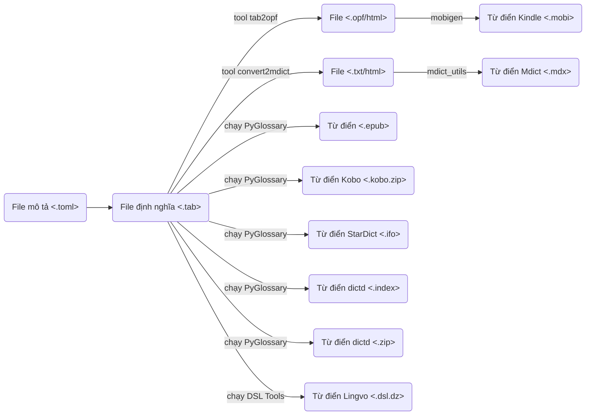

# Từ điển tiếng Việt dành cho máy đọc sách Kindle, Kobo, Pocketbook, Boox v.v. cũng như trên điện thoại và máy tính, như StarDict, Lingvo, Yomichan/Yomitan, v.v.

Mã nguồn cho từ điển dành cho máy đọc sách Kindle. Để sử dụng từ điển, download tại đây http://catusf.github.io/.

## Ghi chú

## Thực hiện

- Setup môi trường

`make setup`

- Test môi trường

`make test`

- Build mẫu vài từ điển

`make sample`

- Build tất cả từ điển

`make all`


### SSH Private Key

- Khi tạo khởi động CodeSpace để dev, thực hiện lệnh sau để đồng bộ SSH Private Key từ CodeSpace secret vào SSH Agent

```
eval $(ssh-agent -s) 
ssh-add <(echo "$SSH_PRIVATE_TUDIEN_CODESPACE") 
```

### Submodules

- Sync submodule về bằng lệnh

```
git submodule update --init --recursive
```

## Codespaces

Khi dùng Codespaces để develop, ban đầu hãy chạy 2 lệnh sau để cài đặt tool:

```
./bin/install_utilities.sh
./bin/install_wine32.sh

```

Sau đó test lại bằng

```
make sample
```


## Tại sao?
Do tôi thấy cần:
- Có các từ điển có chất lượng để giúp việc học hỏi của bản thân và mọi người
- Lập trình viên bất kỳ có thể dùng dữ liệu đầu vào ở đây để tạo output khác
- Có thể dễ dàng bổ sung từ điển - chỉ cần tạo 1 file văn bản phân cách bằng dấu \t (.tab) và 1 file mô tả .dfo

Các từ điển cần: 

- Chính xác và dễ tra cứu
- Dùng được trên nhiều thiết bị (Kindle, Kobo, Onyx, mobile và PC apps)

## Các bước cách tạo ra file từ điển
1. Cài Python 3.x
2. Cài các package cần thiết `pip install -r requirements.txt`
3. Tạo mới hay sửa file định nghĩa từ điển (như `./dict/TudienCuatoi.tab`)
4. Tạo một file mô tả từ điển (như `./dict/TudienCuatoi.dfo`)
5. Chạy dòng lệnh `python ./bin/convert_all.py` để tạo từ điển. Kết quả sẽ có trong thư mục `output`

Việc còn lại là copy file .mobi vừa được tạo ra bằng dây cáp USB vào thư mục `documents` trên Kindle để bắt đầu sử dụng.



## Danh sách các từ điển và số từ hiện có

Xem danh sách đầy đủ ở đây [catusf](https://catusf.github.io/).

## Chat với tác giả
👉 [**Chat với tác giả trên Discord:**](https://discord.gg/Zr4XUgH7)
 
[](https://github.com/catusf/tudien/actions/workflows/release_all.yml)
